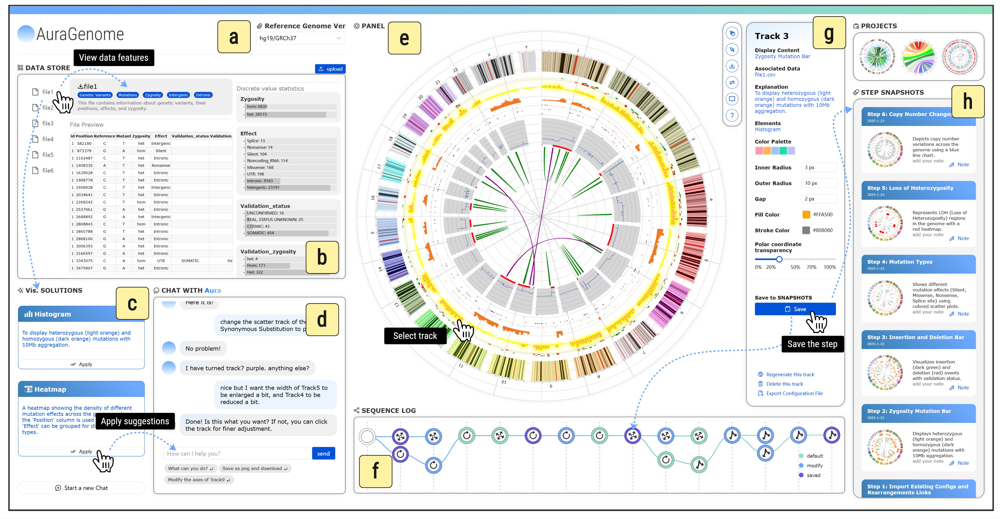
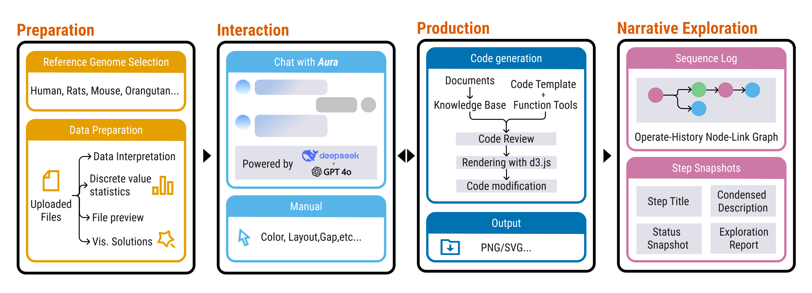

# AuraGenome

一个基于Vue3和Python的前后端分离项目，用于自动化生成和可视化环形生物基因组学图表。

[](https://vuejs.org/) [](https://www.python.org/) [](https://flask.palletsprojects.com/) [](https://vitejs.dev/)
[](https://opensource.org/licenses/MIT)  [](#)  [](#)


---



## 环境要求

- Python 3.x
- Node.js 16+
- Conda（用于管理Python环境）

## 安装步骤

### 后端安装

1. 使用Conda创建并激活环境：
```bash
conda env create -f environment.yml
conda activate base  # 或环境创建时指定的名称
```

2. 进入后端目录并启动服务：
```bash
cd back_end
python run.py
```

### 前端安装

1. 进入前端项目目录：
```bash
cd front_end/autocc
```

2. 安装依赖：
```bash
npm install
```

3. 启动开发服务器：
```bash
npm run dev
```

## 开发说明

- 后端服务默认运行在 `http://localhost:5000`
- 前端开发服务器默认运行在 `http://localhost:5173`
- 使用Vue 3 + Vite作为前端开发框架
- 后端使用Flask框架提供API服务
